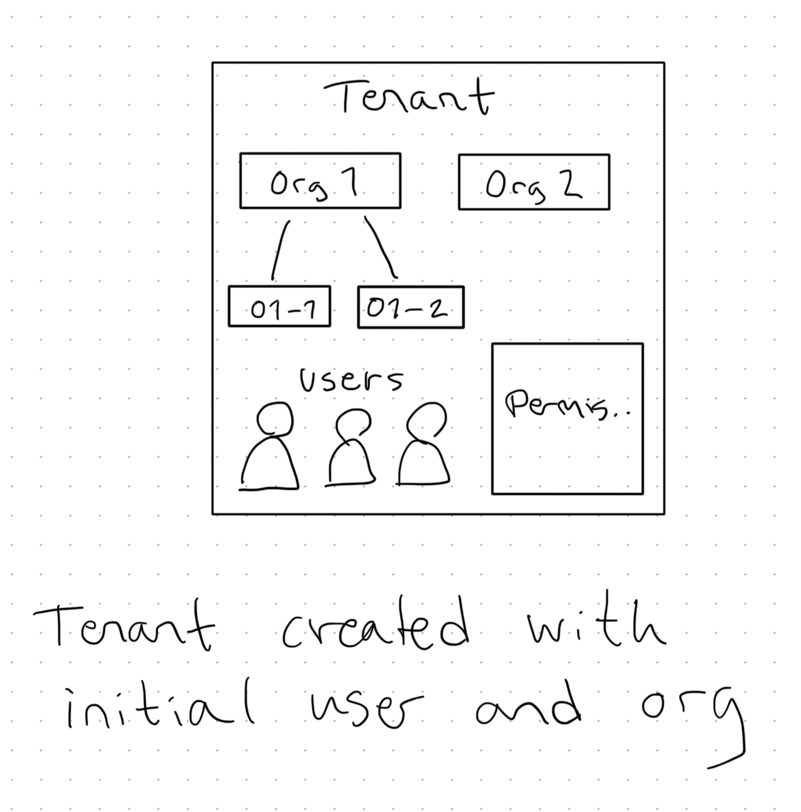

# Multi-tenancy

This document outlines multi-tenancy in YourBrand.

## Summary

YourBrands has multiple tenants.

Identity Management service is responsible for managing tenancy.

## Model

</img>

### Tenant

Represents a tenant - loosely corresponding to a client company, or business group.

Owns/has users.

Must have at least one organization.

### Organization

Represents a company, or a site.

Have member users.

May have sub-organizations.

### User

User might have different roles.

Belongs to a Tenant.

### Permissions

Permissions for individual users.

## Identity Management

This is the service responsible for managing tenancy, users, orgs, and centralized permissions.

Other services get notified of changes to tenants, users, and organizations, via events, and they can then update their local information.

This service serves as an authentication provider, using OIDC and OAuth.

### Authentication

The "tenant_id" claim is included with the auth token (JWT), and extracted by TenantContext on behalf or the current service.